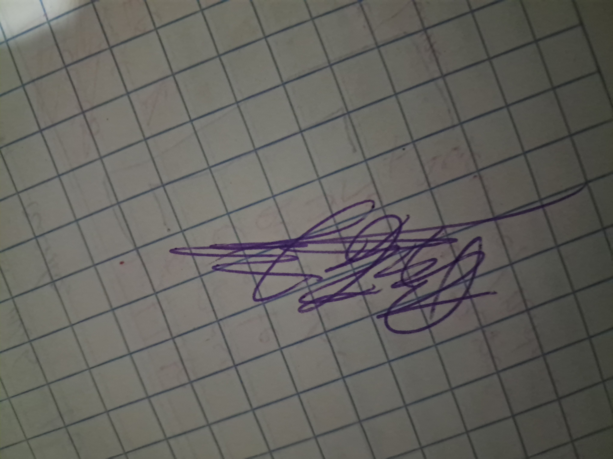

# Certificacion de Calidad - Entrega 1

## Proyecto

Sistema de Gestion Documental y Reportes para Meditec.

## Declaracion

Los integrantes del equipo certificamos que la Entrega 1 fue revisada antes de
ser presentada y que los documentos incluidos corresponden al analisis,
propuesta y diseno conceptual del proyecto.

Tambien declaramos que el uso de herramientas de inteligencia artificial fue
documentado en la bitacora correspondiente y que los resultados fueron revisados
por el grupo antes de incorporarse al repositorio.

## Checklist de calidad

| Criterio | Cumple | Observacion |
| --- | --- | --- |
| Estructura de carpetas obligatoria del proyecto | Si | Se mantiene la estructura solicitada en el enunciado. |
| README.md actualizado | Si | Incluye descripcion general, alcance y estructura del repositorio. |
| Documento de propuesta incluido | Si | Ubicado en `docs/entrega-1/ENTREGA1_PROPUESTA.md`. |
| Documento de requerimientos incluido | Si | Ubicado en `docs/entrega-1/ENTREGA1_REQUERIMIENTOS.md`. |
| Cronograma Gantt incluido | Si | Ubicado en `docs/entrega-1/ENTREGA1_GANTT.md`. |
| Diagrama ER Chen incluido | Si | Ubicado en `docs/diagramas/diagrama_chen.png`. |
| Especificacion del ER Chen incluida | Si | Ubicada en `docs/diagramas/ENTREGA1_ER_CHEN.md`. |
| Bitacora de IA actualizada | Si | Ubicada en `docs/bitacora-ia/BITACORA_IA_ENTREGA_1.md`. |
| No hay credenciales reales expuestas | Si | El archivo `.env.example` no contiene datos sensibles. |
| Ortografia y presentacion revisadas | Si | Documentos principales revisados para cierre de Entrega 1. |
| Tag Git de entrega | Pendiente | Debe crearse despues de la revision final. |

## Estandares verificados

| Codigo | Estandar | Estado |
| --- | --- | --- |
| R1 | Estructura de carpetas obligatoria | Cumplido |
| R2 | README.md con informacion del proyecto | Cumplido |
| R5 | Tag por entrega | Pendiente |
| R6 | Sin credenciales reales | Cumplido |
| D1 | Redaccion clara en documentos | Cumplido |
| D2 | Archivos identificados por entrega | Cumplido |
| D3 | Diagrama ER editable y exportable | Cumplido |
| D4 | Trazabilidad entre requerimientos y diseno | Cumplido |

## Integrantes

| Nombre | Carne | Firma |
| --- | --- | --- |
| Carlos Geovanni Lopez Rodriguez | 2690-23-2511 |  |

## Fecha

01/09/2026
