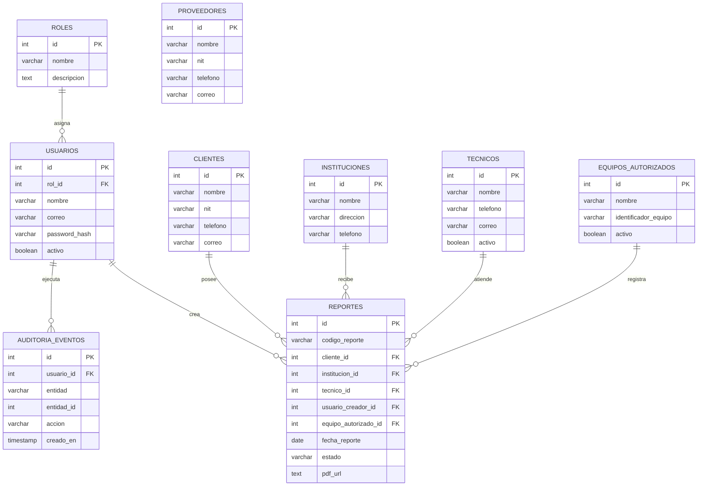

# Modelo Entidad-Relacion

```mermaid
erDiagram
    ROLES ||--o{ USUARIOS : asigna
    USUARIOS ||--o{ REPORTES : crea
    USUARIOS ||--o{ AUDITORIA_EVENTOS : ejecuta
    CLIENTES ||--o{ REPORTES : posee
    INSTITUCIONES ||--o{ REPORTES : recibe
    TECNICOS ||--o{ REPORTES : atiende
    EQUIPOS_AUTORIZADOS ||--o{ REPORTES : registra

    ROLES {
        int id PK
        varchar nombre
        text descripcion
    }

    USUARIOS {
        int id PK
        int rol_id FK
        varchar nombre
        varchar correo
        varchar password_hash
        boolean activo
    }

    EQUIPOS_AUTORIZADOS {
        int id PK
        varchar nombre
        varchar identificador_equipo
        boolean activo
    }

    CLIENTES {
        int id PK
        varchar nombre
        varchar nit
        varchar telefono
        varchar correo
    }

    PROVEEDORES {
        int id PK
        varchar nombre
        varchar nit
        varchar telefono
        varchar correo
    }

    TECNICOS {
        int id PK
        varchar nombre
        varchar telefono
        varchar correo
        boolean activo
    }

    INSTITUCIONES {
        int id PK
        varchar nombre
        varchar direccion
        varchar telefono
    }

    REPORTES {
        int id PK
        varchar codigo_reporte
        int cliente_id FK
        int institucion_id FK
        int tecnico_id FK
        int usuario_creador_id FK
        int equipo_autorizado_id FK
        date fecha_reporte
        varchar estado
        text pdf_url
    }

    AUDITORIA_EVENTOS {
        int id PK
        int usuario_id FK
        varchar entidad
        int entidad_id
        varchar accion
        timestamp creado_en
    }
```
